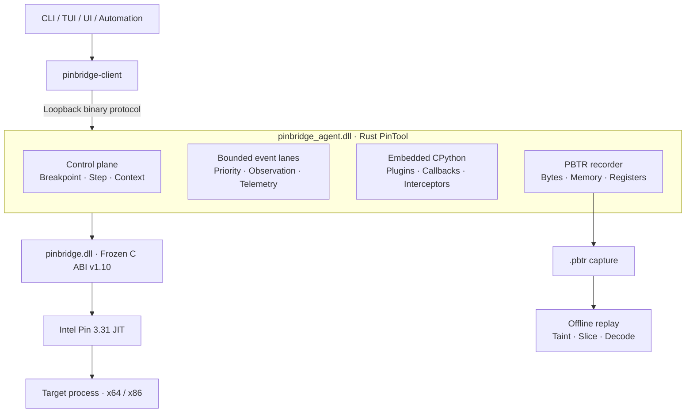

<div align="center">

# PinBridge Next

### 面向 Windows x64 / x86 的可编程动态二进制分析平台

以 Intel Pin 3.31 为执行引擎，通过稳定 C ABI、Rust Agent 与内嵌 CPython，提供从实时插桩、精确停点到录制重放与污染分析的一体化工作流。

<p>
  
  
  
  
  
</p>

[核心能力](#核心能力) · [架构](#架构) · [快速开始](#快速开始) · [Python 自动化](#python-自动化) · [录制与重放](#录制与重放) · [文档](#文档)

</div>

---

## PinBridge 是什么

PinBridge Next 不是简单的 Pin API 包装，也不是只负责展示事件的前端。它把动态分析拆成三条相互隔离的路径：

| 路径 | 负责什么 | 设计目标 |
| --- | --- | --- |
| **原生热路径** | 指令、内存、分支、Hook、系统调用与上下文事件 | 不进入 Python，不跨越 C++ 所有权边界 |
| **控制与脚本路径** | 断点、单步、上下文修改、同步拦截、插件生命周期 | Python 可编排，关键决定可同步返回原生层 |
| **录制与重放路径** | `.pbtr` 窗口录制、反汇编、前向污染、反向切片 | 将高成本分析移出目标进程 |

核心理念很直接：**Python 声明策略，原生层执行热路径，事件通过有界通道交给脚本和前端。**

## 核心能力

### 调试与控制

- 精确软件停点、单步进入与单步越过，支持 x64 / x86。
- 停止、恢复、线程与模块枚举、内存读写、寄存器读写、符号解析和反汇编。
- 运行时 Hook 点与断点槽分离；Hook 可观察，也可同步修改寄存器、返回值和控制流。
- 异常、系统调用、子进程跟随和调试器事件可交给 Python 作出同步决定。

### Python 事件平台

- 内嵌 CPython 3.10，多插件可热加载、卸载和事务式替换。
- `pb.on(...)` 注册命名事件；`pb.watch(...)` 使用紧凑批处理消费高频事件。
- `pb.breakpoint(...)` 在精确停点后执行脚本逻辑，可读取内存、修改上下文并决定如何继续。
- `pb.instrumentation_set(...)` 将种类、地址范围和线程过滤编译为不可变原生策略。
- 支持指令执行与解码、内存、分支、模块、线程、进程生命周期、SMC、异常、系统调用、Hook、Trace、函数和基本块事件。

### 录制与离线分析

- 独立录制通道采集指令字节、具体内存地址、访问值、寄存器快照和控制流边。
- 固定格式 `.pbtr` 支持截断尾部检测、序列缺口报告与无损重复记录压缩。
- 纯 Python 重放器支持 x64 / x86、同地址 SMC 解码、字节级寄存器与影子内存污染。
- 已实现前向污染传播、寄存器/内存汇点、控制流汇点和基于具体 EA 的反向切片。

### 稳定 ABI 与多前端

- `pinbridge.dll` 提供冻结的 C ABI v1.10；C++ 类型、异常和 STL 不跨越边界。
- 句柄、缓冲区与所有权契约明确，可供 Rust、Python 或其他语言绑定。
- Rust workspace 提供协议、客户端、CLI、TUI、UI 与 Agent。
- Loopback 二进制协议允许 CLI、自动化程序、AI/MCP 客户端或自定义前端接入。

## 架构



热路径上的分析回调只写固定大小记录。Python 回调统一在 Agent 内部脚本线程执行；需要改变应用现场的 Hook、异常或系统调用使用专门的同步拦截通道，而不是让普通遥测事件阻塞目标线程。

## 快速开始

### 环境要求

- Windows 10 / 11
- Visual Studio 2022 C++ 工具链
- CMake
- Rust + Cargo
- Intel Pin 3.31 SDK
- CPython 3.10（x86 构建脚本可校验并准备官方 embeddable 包）

### 构建

```powershell
$env:PIN_ROOT = "D:\sdk\pin-3.31"

# 构建 C ABI 桥；-Arch 可取 x64 或 x86
.\Build-Pin.ps1 -Configuration Release -Arch x64
.\Build-Pin.ps1 -Configuration Release -Arch x86

# 构建 x64/x86 Agent 与控制端
Push-Location .\bindings\rust
.\build-agents.ps1
Pop-Location
```

### 启动目标与控制端

```powershell
$env:PINBRIDGE_AGENT_PORT = "9011"

& "$env:PIN_ROOT\intel64\bin\pin.exe" `
  -t ".\bindings\rust\target\release\pinbridge_agent.dll" `
  -- "C:\Windows\System32\hostname.exe"
```

另开一个终端：

```powershell
$cli = ".\bindings\rust\target\release\pinbridge-cli.exe"

& $cli --port 9011 ping
& $cli --port 9011 modules
& $cli --port 9011 threads
& $cli --port 9011 events 20
```

## Python 自动化

下面的插件只在目标函数范围内启用运行时指令事件。Python 负责声明和消费，实际过滤与采集由原生层完成。

```python
import pb

POLICY_GENERATION = 0


def on_instruction(event):
    pb.print(
        f"tid={event['tid']} "
        f"ip={event['address']:#x} "
        f"size={event['size']} "
        f"policy={event['policy_generation']}"
    )


def pb_init():
    global POLICY_GENERATION

    entry = pb.resolve_name("ntdll.dll!NtCreateFile")
    if not entry:
        raise RuntimeError("NtCreateFile was not resolved")

    pb.on("instruction", on_instruction)
    POLICY_GENERATION = pb.instrumentation_set(
        kinds=["instruction"],
        ranges=[(entry, entry + 0x80)],
    )
    pb.print(f"policy {POLICY_GENERATION} armed at {entry:#x}")
```

```powershell
& $cli --port 9011 script run .\plugin.py
& $cli --port 9011 script output --follow
& $cli --port 9011 script off all
```

更完整的断点、Hook、异常接管、系统调用拦截和生命周期示例位于 [`examples/python`](examples/python) 与 [`fixtures`](fixtures)。

## 录制与重放

```powershell
# 在指定范围录制指令与内存事件
& $cli --port 9011 trace start exec,memory `
  0x140000000 0x140100000 C:\tmp\window.pbtr

& $cli --port 9011 trace stop

# 离线污染传播与反向切片
Push-Location .\examples\python\replay
python .\taint.py C:\tmp\window.pbtr forward `
  --source mem:0x140020000:0x100 `
  --sink reg:RAX

python .\taint.py C:\tmp\window.pbtr slice `
  --at 12345 `
  --operand reg:RDX
Pop-Location
```

对于壳、SMC 或自解密目标，优先录制携带实际执行字节的 `exec_bytes`，避免使用磁盘 PE 字节推断运行时语义。

## 验证状态

| 范围 | 当前基线 |
| --- | ---: |
| C/C++ ABI 与契约测试 | 60 / 60 |
| Rust Agent 单元测试 | 38 / 38 |
| Python PBTR / replay 测试 | 37 / 37 |
| x64 Agent | Release 编译 + 真实 Pin 回归通过 |
| x86 Agent | Release 编译 + Python 精确断点回归通过 |
| Python 动态插桩 | 命名回调、批处理、Trace、函数、基本块真机通过 |

常用验证入口：

```powershell
.\Run-Tests.ps1

$env:PINBRIDGE_PIN_EXE = "$env:PIN_ROOT\intel64\bin\pin.exe"
python .\tests\control_e2e.py
python .\tests\script_e2e.py
python .\examples\python\replay\test_taint.py

.\fixtures\instrumentation_python_demo\run.ps1
.\fixtures\exception_python_demo\run.ps1
.\fixtures\syscall_python_demo\run.ps1
.\fixtures\x86\run_python.ps1
```

## 项目结构

```text
include/pinbridge/     冻结 C ABI 头文件与生成常量
src/                   ABI facade、后端接口与 Intel Pin 实现
msvc/                  PinTool DLL 工程
bindings/rust/         Rust workspace：Agent、协议、客户端与前端
examples/python/       Python 插件与离线重放工具
fixtures/              可重复执行的真实 Pin 集成测试
tests/                 ABI 契约、控制面与脚本 E2E
docs/                  设计、脚本 API 与分析路线文档
tools/                 绑定和代码生成工具
```

## 文档

- [Python 事件平台设计](docs/python-event-platform.md)
- [Python 脚本 API 与部署](docs/scripting.md)
- [录制、污染与切片路线](docs/taint-roadmap.md)
- [离线 replay 使用说明](examples/python/replay/README.md)

## 平台边界

- 当前目标平台为 Windows x64 / x86；Linux 平台层尚未实现。
- Intel Pin 3.31 在 Windows JIT 模式下不支持重新附加。PinBridge 会明确报告不支持，不会把失败伪装成成功。
- 普通高频事件是异步观察通道；需要修改应用现场时，应使用断点或同步拦截 API。
- 项目面向授权的软件分析、调试、兼容性研究与安全研究场景。

---

<div align="center">
  <sub>Stable ABI below. Native policy in the hot path. Python everywhere else.</sub>
</div>
